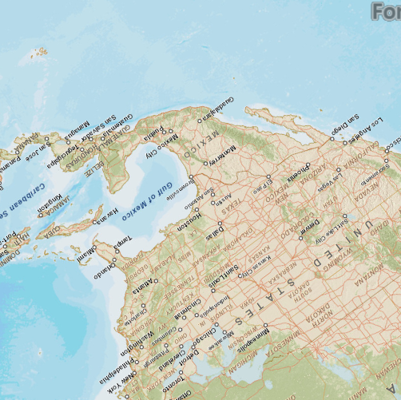

#Map rotation

This sample demonstrates how to rotate a map view.

##How it works

The rotation is set using a slider control, with the rotation in degrees displayed to the right of the slider. Rotation using two fingers on a touch screen device is diabled in this sample. The rotation is changed by calling the `setViewpoint` method on the map view.

##Features
- MapView
- Map
- Basemap
- Point
- SpatialReference