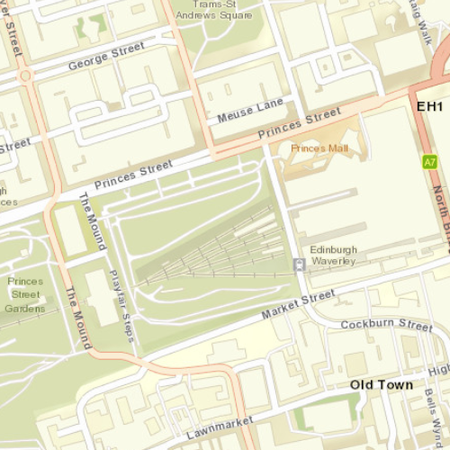

# Min-Max Scale

This sample demonstrates how to set the minimum and maximum scale of a map.

## How to use the sample
Use the mousewheel or pinch gesture to zoom in and out of the map. Notice that the scale of which you can do that is limited by the application.

## How it works
1. Use the `setMinScale` or `setMaxScale` methods (both part of the C++ API) in your app's `.cpp` file to set these boundaries.

## Relevant API
 - Map::setMinScale
 - Map::setMaxScale

## Tags
Maps, 2D, scale, setMinScale, setMaxScale, zoom

