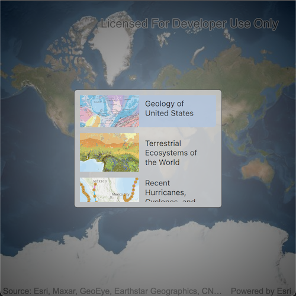

# Open map (URL)

Display a web map.

## Use case

For displaying web maps stored on ArcGIS Online (e.g. soil survey results, as demonstrated in this sample).

## How to use the sample

A web map can be selected from the drop-down list. On selection the web map displays in the map view.

## How it works

1. Create a URL comprised of the Organization's Portal URL and the webmap of interest.
2. Create a `Map` using the URL.
3. Set the map to the `MapView`.

## Relevant API

* Map
* MapView

## Additional information

Mobile map packages can also include address locators and geometric networks. For an example of this, see the "Mobile Map Search and Route Sample".

## Tags

portal item, web map
