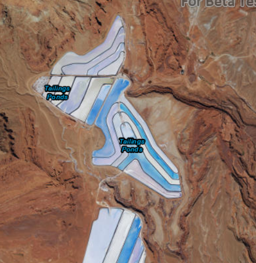

# Set initial map area

This sample demonstrates how to create a map with a predefined initial extent.

## How it works

A `Viewpoint` is created from an `Envelope`, and is applied to the map by calling the `setInitialViewpoint` method.

## Features
- MapView
- Map
- Basemap
- Viewpoint
- Envelope
- SpatialReference
