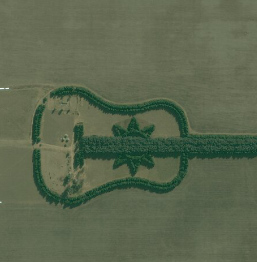

# Set initial map location

This sample demonstrates how to create a map with a basemap, centered at a specific location and scale.

## How it works

This is one of the most basic samples for the ArcGIS Runtime SDK for Qt. It shows how to construct a map by passing in a basemap type, a latitude and longitude, and a scale.

## Features
- MapView
- Map
