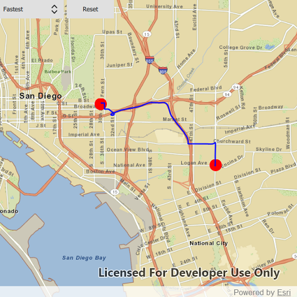

# Offline routing

This sample demonstrates how to solve a route on-the-fly using offline data.

## How to use the sample
Click near a road to add a stop to the route. A red graphic will show the position of the stop. After adding at least 2 stops, a route will display. Use the combo box in the top left corner to choose between the travel modes "Fastest" and "Shortest" (how the route is optimized). To move a stop, press the mouse on the graphic to select it, then move your mouse while pressing to reposition, and finally release the mouse to set the new position. The route will update on-the-fly while moving stops. The green box marks the boundary of the route geodatabase.

## How it works
To display a `Route` using a `RouteTask` with offline data:

1. Create the map's `Basemap` from a local tile package using a `TileCache` and `ArcGISTiledLayer`
2. Create a `RouteTask` with an offline locator geodatabase
3. Get the `RouteParameters` using `routeTask.createDefaultParameters()`
4. Create `Stop`s and add them to the route task's parameters.
5. Solve the `Route` using `routeTask.solveRoute(routeParameters)`
6. Create a graphic with the route's geometry and a `SimpleLineSymbol` and display it on another `GraphicsOverlay`.

## Relevant API
 - ArcGISTiledLayer
 - Graphic
 - GraphicsOverlay
 - MapView
 - RouteTask
 - RouteParameters
 - RouteResult
 - SimpleLineSymbol
 - SimpleMarkerSymbol
 - Stop
 - TaskWatcher
 - TileCache

## Offline data
The data used by this sample is available on [ArcGIS Online](https://arcgisruntime.maps.arcgis.com/home/item.html?id=567e14f3420d40c5a206e5c0284cf8fc).

Link | Local Location
---------|-------|
|[San Diego Streets TPK](https://arcgisruntime.maps.arcgis.com/home/item.html?id=567e14f3420d40c5a206e5c0284cf8fc)| `<userhome>`/ArcGIS/Runtime/Data/tpk/san_diego |

## Tags
offline, disconnected, network analysis, routing, fastest, shortest, routing, locator, navigation, connectivity, turn-by-turn
