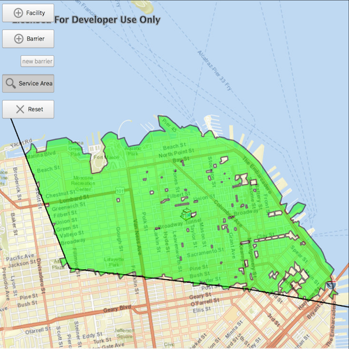

# Service area

Demonstrates how to find services areas around a point using the
ServiceAreaTask. A service area shows locations that can be reached from
a facility based off a certain impedance \[such as travel time\].
Barriers can also be added which can affect the impedance by not letting
traffic through or adding the time is takes to pass that barrier.

## How to use sample

  - In order to find any services areas at least one
    `ServiceAreaFaciltiy` needs to be added.
  - To add a facility, select “Facility” from the combo-box then click
    anywhere on the `MapView`.
  - To add a barrier, select “Barrier” from the combo-box and click
    multiple locations on the `MapView` to draw a barrier.
  - To start a new line in a distinct location, click “new barrier”
  - To show service areas around facilities that were added, click the
    “Solve” button.
  - The “Reset” button, clears all graphics and resets the
    `ServiceAreaTask`.

## How it works

To display service areas around a certain location:

  - Create a `ServiceAreaTask` from an online service.
  - Get a `ServiceAreaParameters` from the task using
    `ServiceAreaTask::createDefaultParameters`
  - Set a spatial reference for the parameters using
    `ServiceAreaParameters::setOutputSpatialReference`. This will allow
    any geometry that is returned to be displayed on the `MapView`.
  - Set the parameters to return polygons, which will return any service
    area that needs to be displayed.
  - Add a `ServiceAreaFacilty` to parameters,
    `ServiceAreaParameters::setFacilities`
  - Optionally add `PolylineBarriers` to parameters,
    `ServiceAreaParameters::setPolylineBarriers`
  - Get the `ServiceAreaResult` by solving the service area task using
    the parameters, `ServiceAreaTask.solveServiceArea`
  - Get any `ServiceAreaPolygons` that were returned using
    `ServiceAreaResult::resultPolygons`
  - facilityIndex is the faciltiy from the `MapView` that you want to
    get the services areas of.
  - Display service areas to `MapView` by creating graphics for their
    geometry and adding to a graphics overlay.
