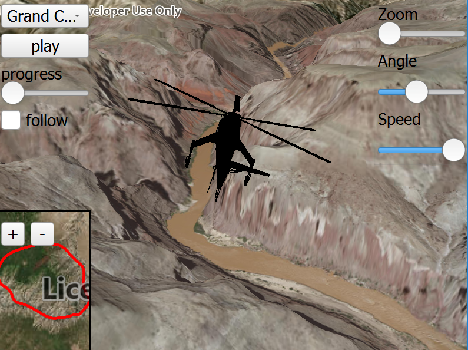

# Animate 3D symbols
Demonstrates how to animate a graphic's position and rotation and follow it using a `OrbitGeoElementCameraController`.
Also shows how to combine a `SceneView` and `MapView` in an MVC application with property binding.

## How to use the sample

Animation Controls (Top Left Corner):
 - Select a mission -- selects a location with a route for the plane to fly
 - Play/Pause -- toggles playing and stopping the animation
 - Fixed/Follow -- toggles the camera's free cam mode and follow
 - Mission progress -- shows how far along the route the plane is. Slide to change keyframe in animation

Camera Controls (Top Right Corner):
 - Camare zoom -- distance between camera and plane
 - Camera angle -- viewing angle between camera and plane
 - Flight speed -- controls speed of animation

 2D Map Controls (Bottom Left Corner):
 - Plus and Minus -- controls distance of 2D view from ground level

## How it works
To animate a `Graphic` by updating it's `Geometry`, heading, pitch, and roll:

1. Create a `GraphicsOverlay` and add it to the `SceneView`.
2. Create a `ModelSceneSymbol`.
3. Create a `Graphic` and set the geometry to a point where the graphic will be located in scene view
4. Set the graphic's symbol to the one we made above.
5. Add Attributes to graphic. Get attributes from graphic, `Graphic::attributes()`.
6. Add heading, pitch, and roll attribute, `insertAttribute("heading", myHeading);`.
7. Create a `SimpleRenderer` to access and set it's expression properties - e.g. `setHeadingExpression("[heading]");`.
8. Add graphic to the graphics overlay.
9. Add a renderer to graphics overlay
10. Create a `OrbitGeoElementCameraController` which is set to target the graphic.
11. Assign the camera controller too the `SceneView`
12. Update graphic's location, `Graphic::setGeometry(const Geometry& geometry);`.
13. Update graphics's heading, pitch, and roll, `replaceAttribute("heading", myHeading);`.
14. The camera controller will automatically update the view to follow the graphic.

## Features
 - Map
 - Scene
 - Camera
 - GlobeCameraController
 - Graphic
 - GraphicsOverlay
 - SurfacePlacement
 - MapView
 - ModelSceneSymbol
 - OrbitGeoElementCameraController
 - Point
 - Polyline
 - Renderer
 - SceneProperties
 - SceneView
 - Viewpoint

## Offline Data
Read more about how to set up the sample's offline data [here](http://links.esri.com/ArcGISRuntimeQtSamples).

Link | Local Location
---------|-------|
|[Model Marker Symbol Data](https://www.arcgis.com/home/item.html?id=681d6f7694644709a7c830ec57a2d72b)| `<userhome>`/ArcGIS/Runtime/Data/3D/Bristol/Collada/Bristol.dae |
|[GrandCanyon.csv mission data](https://www.arcgis.com/home/item.html?id=290f0c571c394461a8b58b6775d0bd63)| `<userhome>`/ArcGIS/Runtime/Data/3D/Missions/GrandCanyon.csv |
|[Hawaii.csv mission data](https://www.arcgis.com/home/item.html?id=e87c154fb9c2487f999143df5b08e9b1)| `<userhome>`/ArcGIS/Runtime/Data/3D/Missions/Hawaii.csv |
|[Pyrenees.csv mission data](https://www.arcgis.com/home/item.html?id=5a9b60cee9ba41e79640a06bcdf8084d)| `<userhome>`/ArcGIS/Runtime/Data/3D/Missions/Pyrenees.csv |
|[Snowdon.csv mission data](https://www.arcgis.com/home/item.html?id=12509ffdc684437f8f2656b0129d2c13)| `<userhome>`/ArcGIS/Runtime/Data/3D/Missions/Snowdon.csv |
