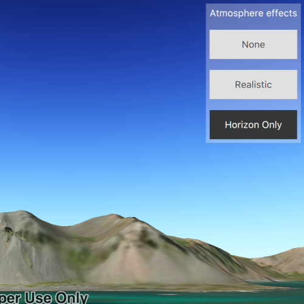

# Change atmosphere effect

Changes the appearance of the atmosphere in a scene.

## How to use the sample

Select one of the three available atmosphere effects. The sky will change to display the selected atmosphere effect.

## How it works

To change the atmosphere effect:

1. Create a ``Scene`` and display it in a ``SceneQuickView``.
2. Change the atmosphere effect with ``SceneQuickView::setAtmosphereEffect``.

## Relevant API
- ``Scene``
- ``AtmosphereEffect``
- ``SceneQuickView``

## Additional Information

There are three atmosphere effect options:

- **None** - No atmosphere effect. The sky is rendered black with a starfield consisting of randomly placed white dots.
- **Realistic** - Atmosphere effect applied to both the sky and the surface as viewed from above.
- **Horizon only** - Atmosphere effect applied to the sky (horizon) only. This is the default.

## Tags

3D, AtmosphereEffect, Scene
