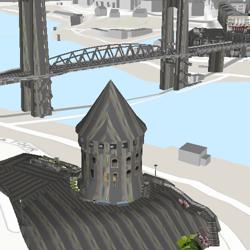

# Display a scene layer

This sample demonstrates how to display a scene service with a scene
layer.

## How it works

This sample displays a scene service with an `ArcGISSceneLayer`, and
sets a `Viewpoint` using a `Camera`.
