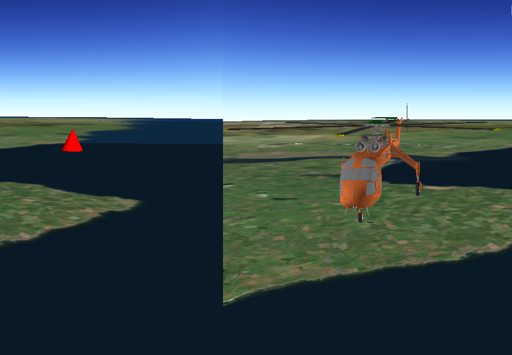

#Distance Composite Symbol (URL)

This sample demonstrates how to create a graphic using a distance composite scene symbol. Distance composite scene symbols can render different symbols depending on the distance between the camera and the graphic.



##How it works

To create and display a ```DistanceCompositeSceneSymbol```:

1. Create a ```GraphicsOverlay``` and add it to the ```SceneView```.
Create symbols for each ```Range``` the composite symbol.
Create a distance composite scene symbol`.
Add a range for each symbol.
Create a ```Graphic``` with the symbol.
Add the graphic to the graphics overlay.

##Features
- Scene
- ArcGISTiledElevationSource
- Camera
- DistanceCompositeSceneSymbol
- DistanceCompositeSceneSymbol.Range
- Graphic
- GraphicsOverlay
- ModelSceneSymbol
- Range
- RangeCollection
- SceneView
- SimpleMarkerSceneSymbol