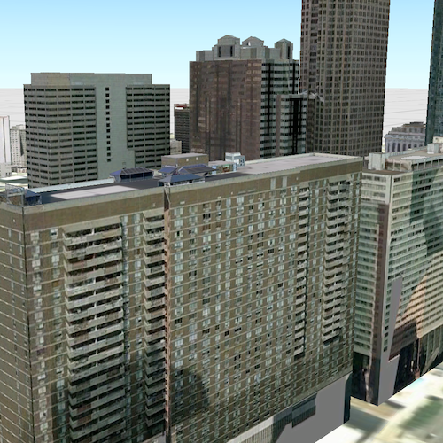

# Open mobile scene package

Opens and displays a scene from a Mobile Scene Package (.mspk).

## Use Case
An .mspk file is an archive containing the data (specifically, basemaps and features), used to display an offline 3D scene.

## How it works
1. Use `MobileScenePackage::isDirectReadSupported` to check whether the package can be read in the archived form (.mspk) or whether it needs to be unpacked.
2. If the mobile scene package requires unpacking, call `MobileScenePackage::unpack` and wait for this to complete.
3. Create a `MobileScenePackage` using the path to the local `.mspk` file or the unpacked directory.
4. Call `MobileScenePackage::load` and check for any errors.
5. When the `MobileScenePackage` is loaded, obtain the first `Scene` from the `MobileScenePackage::scenes` list.
6. Create a `SceneView` and set the scene on the view for display.

## Relevant API
- MobileScenePackage
- Scene
- SceneView

## Offline data
Read more about how to set up the sample's offline data [here](http://links.esri.com/ArcGISRuntimeQtSamples).

Link | Local Location
---------|-------|
|[Philadelphia MSPK](https://www.arcgis.com/home/item.html?id=7dd2f97bb007466ea939160d0de96a9d)| `<userhome>`/ArcGIS/Runtime/Data/mspk/philadelphia.mspk |

## Additional information
Before loading the MobileScenePackage, it is important to first check if direct read is supported. The MobileScenePackage could contain certain data types that would require the data to be unpacked. For example, Scenes containing raster data will need to be unpacked.

## Tags
Offline, Scene, MobileScenePackage

