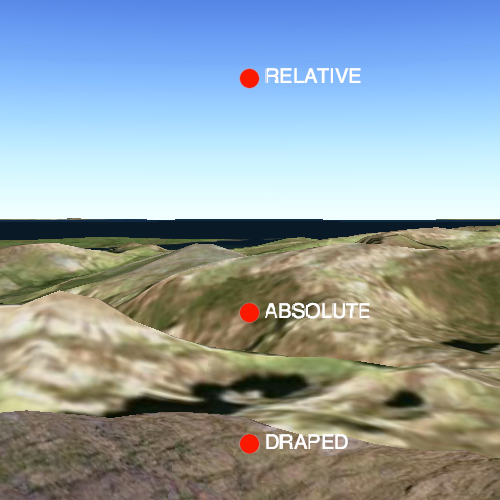

#Surface placement

This sample demonstrates how to control the surface placement of a 3D graphic. Graphics can either be placed relative to the elevation surface (RELATIVE), relative to sea level (ABSOLUTE), or draped over the elevation surface (DRAPED).

##How it works
Graphics in 3D can be displayed in 3 different surface placement modes: draped, relative, or absolute. Draped mode will display the graphic draped over the scene's surface, regardless of the z-value that is set on the geometry. Relative mode will display the graphic by the associated geometry's z-value, relative to the scene's surface (the ground elevation). Absolute mode will display the graphic by the associated geometry'z absolute z-value, relative to sea level. The surface placement is set on the graphics overlay by setting its `sceneProperties` `surfacePlacement`. All graphics added to the overlay will display using the specified surface placement mode.

##Features
- SceneView
- Scene
- Viewpoint
- Camera
- Graphic
- GraphicsOverlay
- SimpleMarkerSymbol
- TextSymbol
- Point
