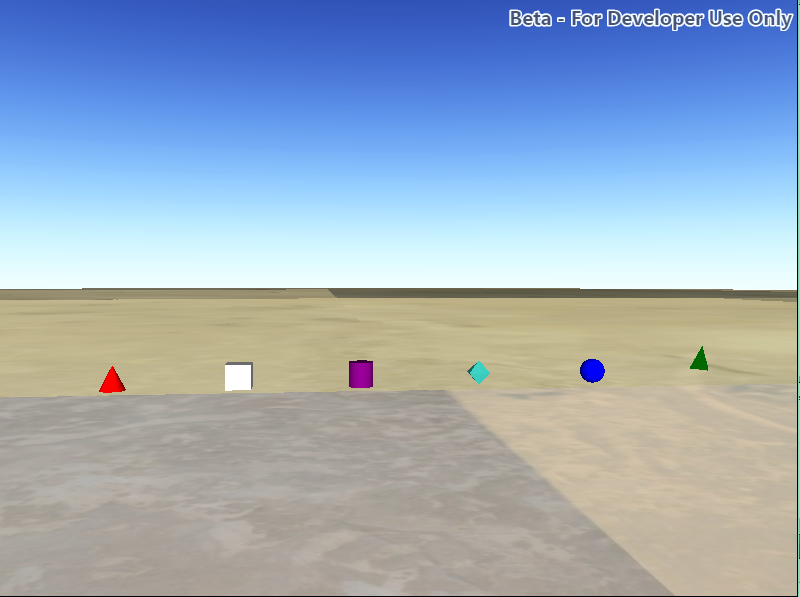

#Symbols (URL)

This sample demonstrates how to create symbols with different 3D shapes. Includes tetrahedrons, cubes, spheres, diamonds, cylinders, and cones.



##How it works

To create a ```SimpleMarkerSceneSymbol``` with a 3D shape:

1. Create a ```GraphicsOverlay```.
2. Create a ```SimpleMarkerSceneSymbol``` by specifying the size and color.
3. Create a ```Graphic``` using the symbol and a ```Point``` geometry.
4. Add the graphics to the graphicsOverlay.
5. Add the graphicsOverlay to the sceneView.

##Features
- SceneView
- Graphic
- GraphicsOverlay
- SimpleMarkerSceneSymbol
