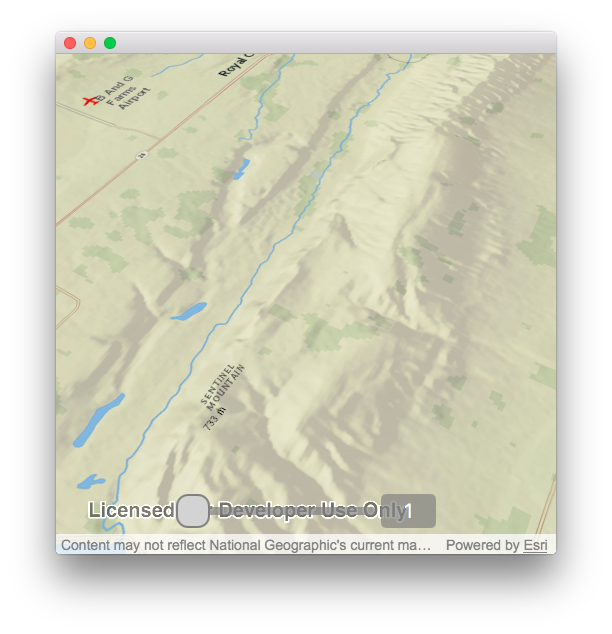

# Terrain Exaggeration

This sample demonstrates how to exaggerate a scene’s terrain surface.

## How to use the sample

Click and drag the slider at the bottom to change the terrain’s
exaggeration.

## How it works

1.  Create a scene and add a slider (with an ID) to the UI via QML.
2.  Create a new function for this called `setExaggerationElevation`
    that accepts a `double` argument.
3.  Check that the surface exists using an `if` statement; if this check
    does not happen, it’s possible that the function runs before the
    scene is even created.
4.  If the `Surface` exists, then access its `setElevationExaggeration`
    method and pass in the `double` parameter.
5.  In the `.qml` file, ensure that the main sample object at the root
    of the QML heirarchy has an ID for reference.
6.  Connect to the QML Slider’s `OnValueChanged` signal handler.
7.  Call the `setElevationExaggeration` method of your root object.
