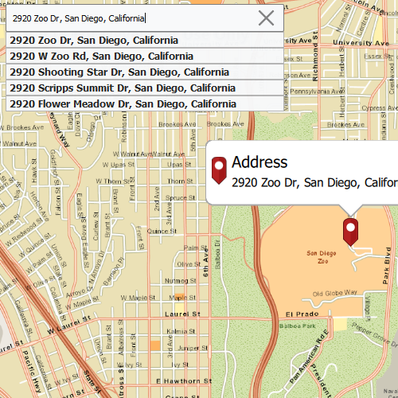

# Offline geocode

Geocode addresses to locations and reverse geocode locations to addresses offline.

## Use case

You can use an address locator file to geocode addresses and locations. For example, you could provide offline geocoding capabilities to field workers repairing critical infrastructure in a disaster when network availability is limited.

## How to use the sample

Type the address in the Search menu option or select from the list to `Geocode` the address and view the result on the map. Tap the location you want to reverse geocode. Select the pin to highlight the `PictureMarkerSymbol` (i.e. single tap on the pin) and then tap-hold and drag on the map to get real-time geocoding.

## How it works

1. Use the path of a .loc file to create a `LocatorTask` object.
2. Set up `GeocodeParameters` and call `geocode` to get geocode results.

## Relevant API

* GeocodeParameters
* GeocodeResult
* LocatorTask
* ReverseGeocodeParametersAsync

## Offline Data

Read more about how to set up the sample's offline data [here](http://links.esri.com/ArcGISRuntimeQtSamples#use-offline-data-in-the-samples).

Link | Local Location
---------|-------|
|[SanDiego tpkx File](https://www.arcgis.com/home/item.html?id=22c3083d4fa74e3e9b25adfc9f8c0496)| `<userhome>`/ArcGIS/Runtime/Data/tpkx/streetmap_SD.tpkx |
|[SanDiego loc Files](https://www.arcgis.com/home/item.html?id=3424d442ebe54f3cbf34462382d3aebe)| `<userhome>`/ArcGIS/Runtime/Data/Locators/SanDiegoStreetAddressLocator/SanDiego_StreetAddress.loc |

## Tags

geocode, geocoder, locator, offline, package, query, search
