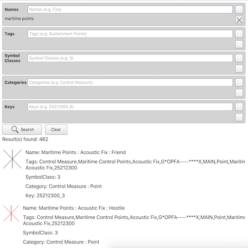

# Search dictionary symbol style

This sample demonstrates how to search a DictionarySymbolStyle and return the results in a ListView. 
In this case, the sample uses The Joint Military Symbology MIL-STD-2525D standard but the same code could be used for other symbol dictionaries.
The MIL-STD-2525D defines a standardized, structured set of graphical symbols for the display of information in command and control (C2) systems and applications.

## How it works

The sample uses the `searchSymbols` function to search for the symbols that match the `SymbolStyleSearchParameters`.

## Features
- DictionarySymbolStyle
- SymbolStyleSearchParameters

## Offline Data
Read more about how to set up the sample's offline data [here](http://links.esri.com/ArcGISRuntimeQtSamples).

Link | Local Location
---------|-------|
|[Mil2525d Stylx File](https://www.arcgis.com/home/item.html?id=c78b149a1d52414682c86a5feeb13d30)| `<userhome>`/ArcGIS/Runtime/Data/styles/arcade_style/mil2525d.stylx |
