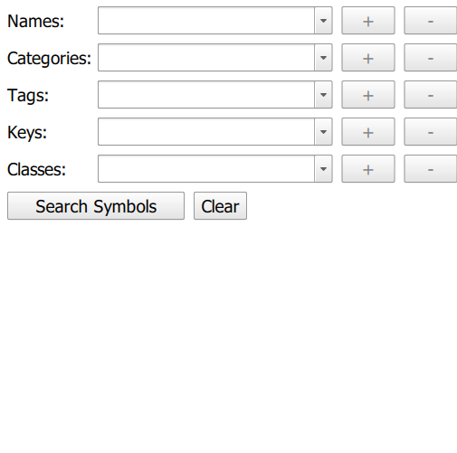

#Search Symbol Dictionary

This sample demonstrates how to search the SymbolDictionary and return the results in a ListView.

##How it works

The sample uses the `searchSymbols` on the `SymbolDictionary` to search for the symbols that match the `StyleSymbolSearchParameters`.

##Features
-SymbolDictionary
-StyleSymbolSearchParameters
