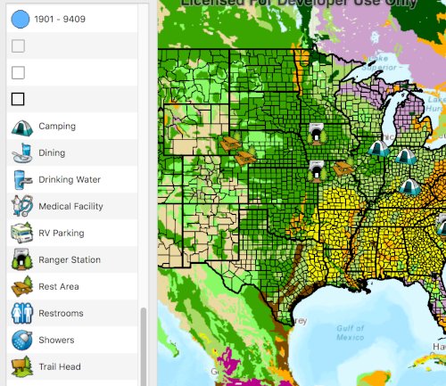

# Build a legend

This sample demonstrates how to build a legend for all the operational layers in the map.

## How it works
The sample utilizes the `setAutoFetchLegendInfos` function on the Map. This property will cause the map to recursively loop through all of the operational layers in the map (including sublayers), and request the `LegendInfo` for each item. All of the resulting LegendInfo objects are passed into the LegendInfoListModel. A QListView consumes this model.

## Features
- MapView
- Map
- Basemap
- ArcGISMapImageLayer
- ArcGISTiledLayer
- FeatureLayer
- ServiceFeatureTable
- LegendInfo
- LegendInfoListModel
