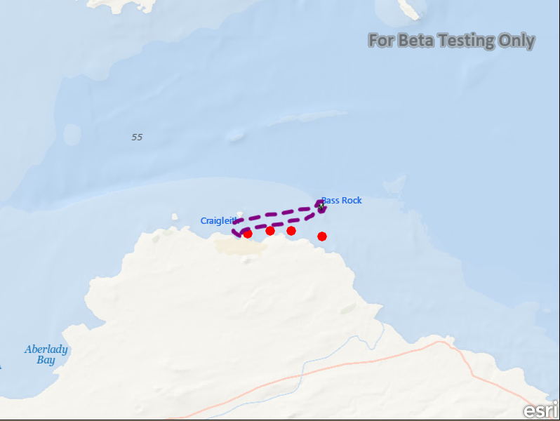

# Add graphics with symbols

This sample demonstrates how to add graphics with symbols to a graphics overlay

## How it works

This sample creates a `GraphicsOverlay` for various types of graphic elements like, a Point, Line and Polygon graphic. It then adds a point, line, polygon and text graphic with individual symbols of type `SimpleMarkerSymbol`, `SimpleLineSymbol`, `SimpleFillSymbol` and `TextSymbol` respectively.

## Tips

You may change the sample code so that you create all the graphics, store them in a list and then add them all at once instead of adding them one at a time as is currently shown.

## Features

- MapView
- Map
- BasemapOceans
- ViewpointCenter
- SimpleFillSymbol
- SimpleLineSymbol
- SimpleMarkerSymbol
- TextSymbol
- Point
- PolylineBuilder
- PolygonBuilder
- GraphicsOverlay
