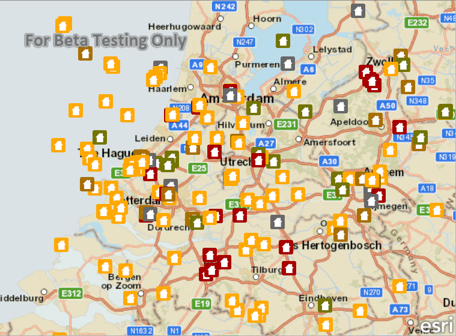

#Add features (feature service)

This sample demonstrates how to add features to a feature service using a ServiceFeatureTable.

##How it works

This sample connects to the mousePressRelease signal on the MapView to obtain the tapped screen coordinate and convert that into a map point. Once the map point is obtained, it creates a new feature using the createFeature method on the ServiceFeatureTable. After the feature is created, it is added to the feature table by calling the addFeature method. Finally, the edits are applied to the feature service by calling the applyEdits method on the ServiceFeatureTable.

##Tips

You may modify the sample code so that when the map view is clicked, a dialog is displayed for the user to select the type of feature they want to add. Obtain this value and set it appropriately in the feature attribute QMap.

##Features
- MapView
- Map
- Basemap
- ServiceFeatureTable
- FeatureLayer
- Point
- Feature