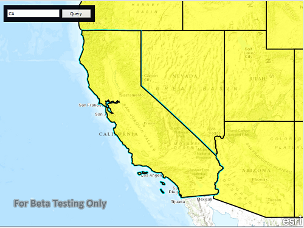

#Feature layer query

This sample demonstrates how to query a feature layer via feature table.

##How it works

When you hit the search button, the sample creates a `QueryParameter` object and specifies the whereClause on it, using the text you provided. It then fires the query on the feature table using the `queryFeatures` method by passing in the queryParameter object. Once the query completes it gets back a FeatureQueryResult. Checking the iterator, if it finds a feature then it highlights the geometry by using `selectFeatures` method on the feature layer.

##Features
- MapView
- Map
- BasemapTopographic
- ServiceFeatureTable
- FeatureLayer
- QueryParameters
- Query

