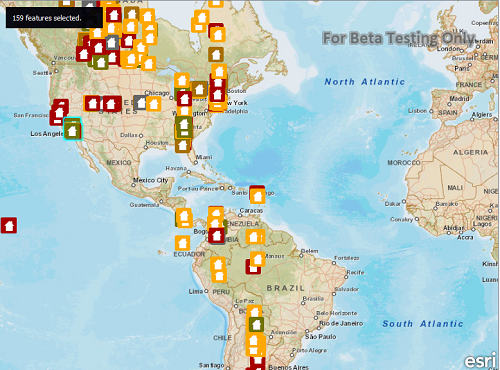

#Feature layer selection

This sample demonstrates how to select features in a feature layer

##How it works

`MapView` provides a signal called `mousePressRelease`, which is fired every time the user clicks/taps on the map. The app uses the mapPoint passed in the method and creates an envelope around that point based on the tolerance. It then creates a `QueryParameter` object and sets it geometry property to the envelope it just created. This query parameter object signifies all the features present in that area/envelope. It then calls the 'selectFeatures` by passing the query object and the selection mode to select features.

##Features
- MapView
- Map
- BasemapTopographic
- ServiceFeatureTable
- FeatureLayer
- Query

