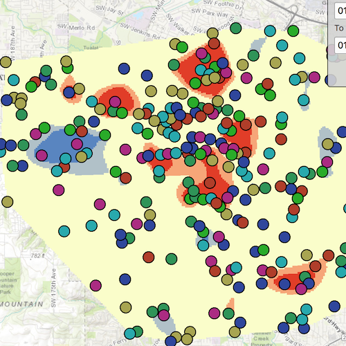

# Analyze hotspots

This sample demonstrates how to execute a geoprocessing task to calculate a hotspot analysis based on the frequency of 911 calls. It calculates the frequency of these calls within a given study area during a specified constrained time period set between 1/1/1998 and 5/31/1998.

## Use case

This tool identifies statistically significant spatial clusters of high values (hot spots) and low values (cold spots). For example, a hotspot analysis based on the frequency of 911 calls within a set region.

## How it works

1. Create a `GeoprocessingTask` with the URL set to the endpoint of a geoprocessing service.
2. Create a query string with the date range as an input of `GeoprocessingParameters`.
3. Use the `GeoprocessingTask` to create a `GeoprocessingJob` with the `GeoprocessingParameters` instance.
4. Start the `GeoprocessingJob` and wait for it to complete and return a `GeoprocessingResult`.
5. Get the resulting `ArcGISMapImageLayer` using `GeoprocessingResult.MapImageLayer`.
6. Add the layer to the map's operational layers.

## Relevant API

* ArcGISMapImageLayer
* GeoprocessingTask
* GeoprocessingJob
* GeoprocessingParameters
* GeoprocessingString
* GeoprocessingResult
* Map

## Tags

analysis, density, geoprocessing, hot spots, hotspots