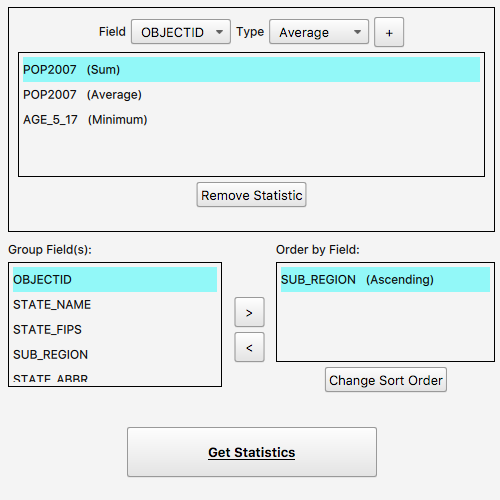

# Statistical query (group & sort)

This sample demonstrates how to query a feature table to get statistics for one or more specified fields. The sample queries a service feature table of US states to get the selected statistics. The results can be grouped and sorted using one or several fields in the table.

## How it works

## Features

