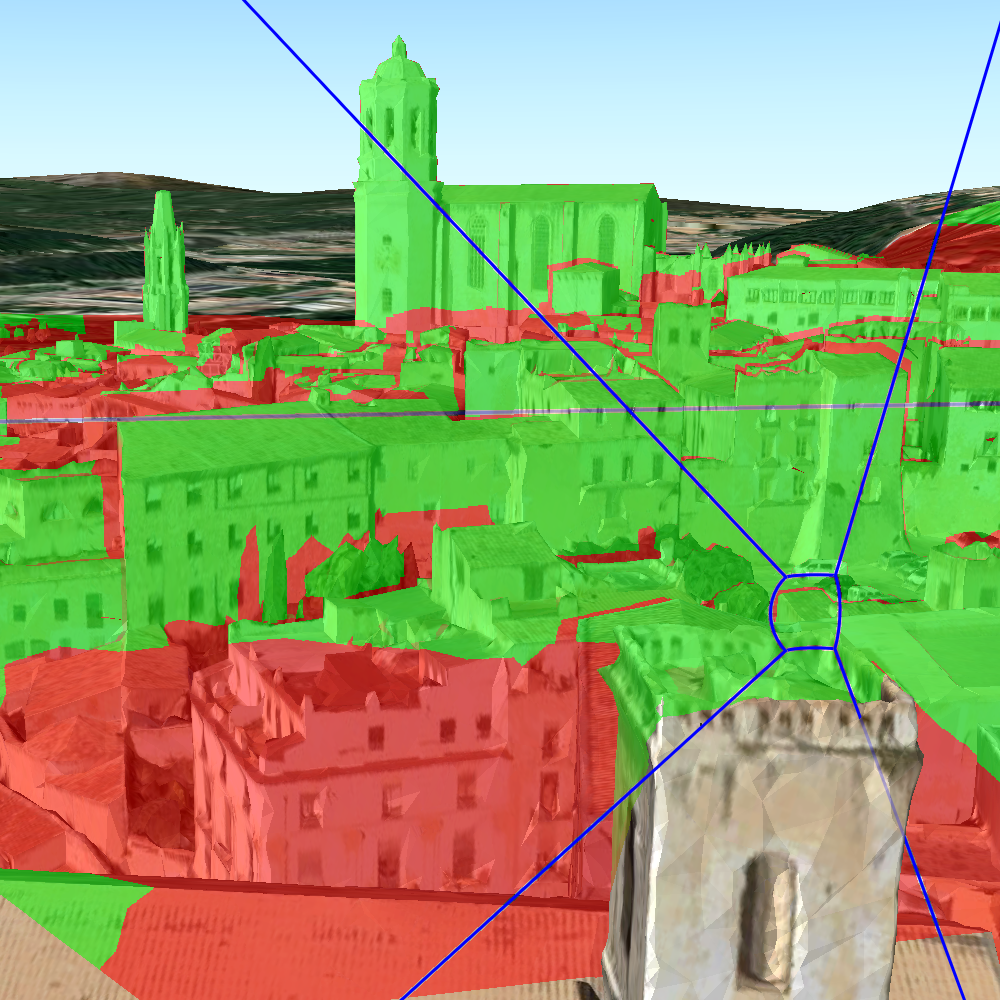

# Viewshed (camera)

This sample demonstrates how to calculate a Viewshed from a SceneView’s
current Camera Viewpoint.

## How it works

A `Viewshed` analysis is a type of visual analysis you can perform on a
scene. The viewshed aims to answer the question ‘What can I see from a
given location?’. The output is an overlay with two different colors -
one representing the visible areas an the other representing the
obstructed areas.

This is achieved by first creating an `AnalysisOverlay`, and adding that
overlay to the `SceneView`. This overlay will hold all of the analyses,
and display the output on the Scene. Next, a `LocationViewshed` is
created from the `SceneView's` current `Viewpoint's` `Camera`. Once the
viewshed is created it is added to the `AnalysisOverlay`. Each time the
button is tapped, the viewshed is updated by calling the
`updateFromCamera` method. This method updates the currently displayed
viewshed to be calculated from the `Camera` that is passed in as a
parameter.
