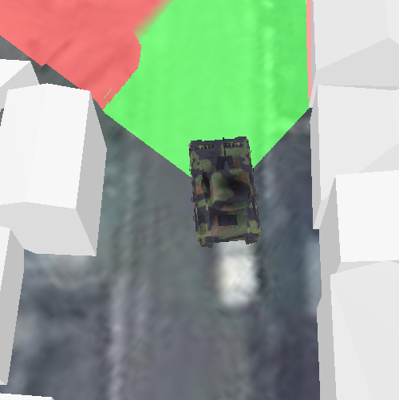

# Viewshed (GeoElement)

This sample demonstrates how to calculate a Viewshed from a GeoElement.

## How it works
A Viewshed analysis is a type of visual analysis you can perform on a scene. The viewshed aims to answer the question 'What can I see from a given location?'. The output is an overlay with two different colors - one representing the visible areas and the other representing the obstructed areas.

This is achieved by first creating a Graphic from a 3D model symbol. Next, a GeoElementViewshed is created by assigning values for the GeoElement, heading, pitch, and various other properties. Once the viewshed is created, it is added to an AnalysisOverlay, which is then added to the SceneView. Whenever the GeoElement's geometry is updated, the viewshed is recalculated and displayed in the overlay.

## Features
- GeoElementViewshed
- AnalysisOverlay
- ArcGISSceneLayer
- GraphicsOverlay
- LayerSceneProperties
- GeometryEngine
- ModelSceneSymbol
- GeodeticDistanceResult
- SimpleRenderer
- OrbitGeoElementCameraController.

## Offline Data
Read more about how to set up the sample's offline data [here](http://links.esri.com/ArcGISRuntimeQtSamples).

Link | Local Location
---------|-------|
|[Model Marker Symbol Data](https://www.arcgis.com/home/item.html?id=07d62a792ab6496d9b772a24efea45d0)| `<userhome>`/ArcGIS/Runtime/Data/3D/bradley_low_3ds/bradle.3ds |
