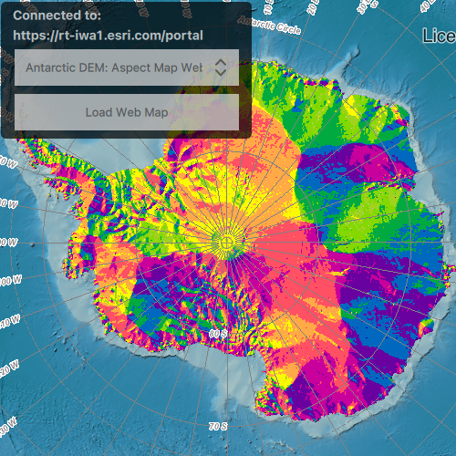

# Integrated windows authentication

Uses Windows credentials to access services hosted on a portal secured with Integrated Windows Authentication (IWA).

## Use case

IWA, which is built into Microsoft Internet Information Server (IIS), works well for intranet applications, but isn't always practical for internet apps.

## How to use the sample

* Search Public

  Click the "Search Public" button. This will anonymously connect to www.arcgis.com and will search for web maps stored on the portal. It will then populate the combo box with the results found from the portal. Select a web map item and click the "load web map" button to display it in the map view.

* Search Secure

  Enter the URL(e.g. https://myorgiwaportal.myorg.com/gis) to your IWA-secured portal in the text field at the top of the screen. Click the "Search Secure". You will be prompted for a username (including domain, such as username@DOMAIN or domain\username), and password. On Windows it will automatically use your current login credentials. If you authenticate successfully, portal item results will display in the combo box below. Select a web map item and click the "load web map" button to display it in the map view.

## How it works

1. Declare an `AuthenticationView` and connect the `AuthenticationManager` to it.
2. The authentication manager object is configured with a challenge handler that will prompt for a Windows login (username and password) if a secure resource is encountered.
3. When a search for portal items is performed against an IWA-secured portal, the challenge handler creates an `UserCredential` object from the information entered by the user or what was automatically obtained by the current Windows login.
4. If the user authenticates, the search returns a list of web maps from `PortalItem` objects and the user can select one to display as an `Map`.

## Relevant API

* AuthenticationManager
* Portal
* UserCredential

## About the data

This sample searches for web map portal items on a secure portal. To successfully run the sample, you need:
 - Access to a portal secured with Integrated Windows Authentication that contains one or more web map items.
 - A login that grants you access to the portal.

## Additional information

More information about IWA and its use with ArcGIS can be found at the following links:
 - [IWA - Wikipedia](https://en.wikipedia.org/wiki/Integrated_Windows_Authentication)
 - [Use Integrated Windows Authentication with your portal](http://enterprise.arcgis.com/en/portal/latest/administer/windows/use-integrated-windows-authentication-with-your-portal.htm)

## Tags

authentication, security, windows
