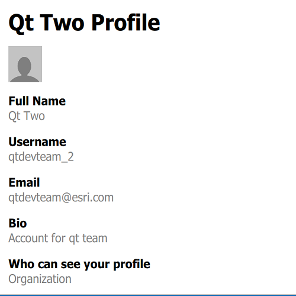

# Portal user info

This sample demonstrates how to retrieve a user's details via a Portal.

## How it works

1. A `Portal` is created, and supplied a `Credential` which uses OAuth in user mode. 
2. When the app launches, the portal is loaded, which triggers an authentication challenge.
3. An `AuthenticationView` listens to the challenge and displays a login screen to allow user credentials to be entered.
4. If the portal is successfully loaded, the `portalUser` property is used to populate a series of fields including:
 - `fullName`
 - `username`
 - `email`
 - `description`
 - `access`
5. The `thumbnailUrl` property is bound to a QML Image to display the user's avatar.
6. Similarly, the `portalInfo` property is used to populate:
 - `organizationName`
 - `organizationDescription`
 - `thumbnailUrl`
 - `canSearchPublic`
 - `canSharePublic`
 
## Relevant API

* AuthenticationManager
* AuthenticationView
* Credential
* PortalInfo
* PortalUser

## About the data

This sample signs into your ArcGIS online account and displays the user's profile information.

## Tags

account, avatar, bio, cloud and portal, email, login, picture, profile, user, username