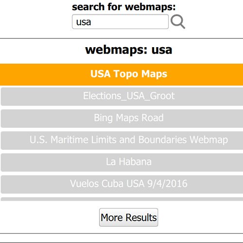

# Search for web map by keyword

Find portal items by using a keyword, and limit the results to items of a certain type - in this case, web maps.

## Use case

Portals can contain many portal items and at times you may wish to query the portal to find what you're looking for. In this example, we search for webmap portal items using a text search.

## How to use the sample

Enter search terms into the search bar. Once the search is complete, a list is populated with the resultant webmaps. Tap on a webmap to set it to the map view. Scrolling to the bottom of the webmap recycler view will get more results.

## How it works

1. A `Portal` is created with no credential set, when the app starts, the portal is loaded.
2. A search bar allows the user to enter a keyword (a tag) to search for * e.g. "usa". 
3. The search term is passed as the `searchString` for a `PortalQueryParametersForItems` which also has the `itemType` set to `Enums.PortalItemTypeWebMap`. NOTE if multiple item types are required these can be set via the `types` property. Since webmaps authored prior to July 2nd, 2014 are not supported, a date filter is also applied.
4. The query parameters are passed to the portal's `findItems` method.
5. Once the `findItems` task is complete, a `PortalQueryResultSetForItems` is obtained by calling `findItemsResult` on the portal.
6. The `PortalItemListModel` from the items result is set on a `ListView` to display the set of web maps. If many web maps match the search criteria, the results will contain only the 1st set (to allow "paging" through the results in batches).
7. If there are additional results, a subsequent query can be issued by clicking the "More Results" button. This passes the itemResult's `nextQueryParameters` object to a new `findItems` operation.
8. When the user double-clicks on a web map in the list, the `PortalItem` is loaded and set as a `Map` on the `MapView`
9. If the item is secured, the user may be prompted to login via the `AuthenticationView`

## Relevant API

* Portal
* PortalQueryParametersForItems
* PortalQueryResultSetForItems
* PortalItemListModel
* PortalItem

## Tags

keyword, query, search, webmap
