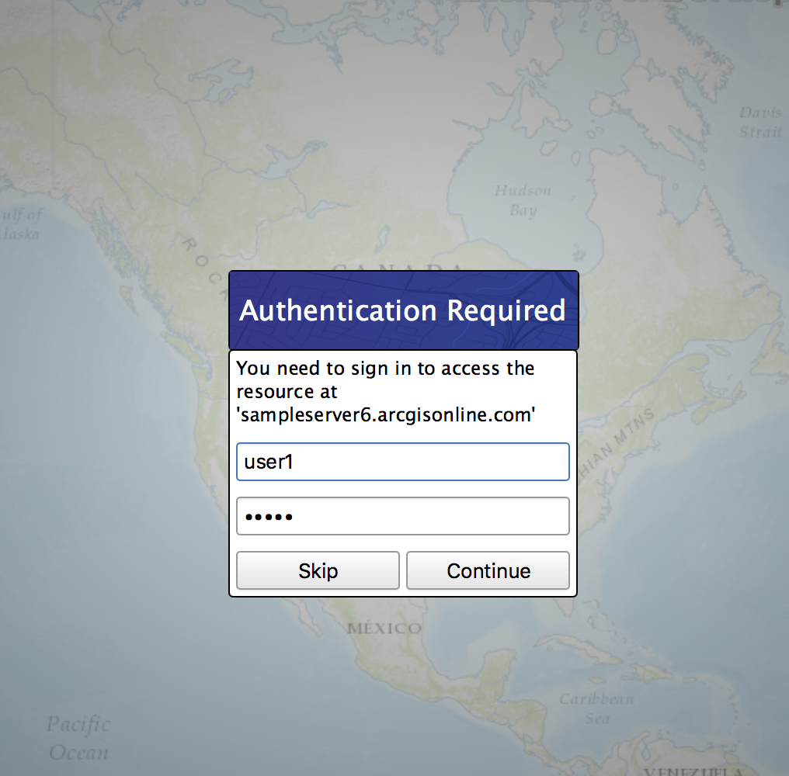

# Token authentication

Access a web map that is secured with ArcGIS token-based authentication.

## Use case

Allows you to access a secure service with the convenience and security of ArcGIS token-based authentication. For example, rather than providing a user name and password every time you want to access a secure service, you only provide those creditials initially to obtain a token which then can be used to access secured resources.

## How to use the sample

Once you launch the app, you will be challenged for an ArcGIS Online login to view the protected map service. Enter a user name and password for this resources. In this case, the username is `user1` and the password is also `user1`.

## How it works

1. Create an `ArcGISMapImageLayer` passing in the URL to a map service that is secured with token-based authentication.
2. Append the map image layer to the operational layers to display the map.

## Relevant API

* Map
* MapView
* ArcGISMapImageLayer

## Tags

authentication, cloud, portal, remember, security
