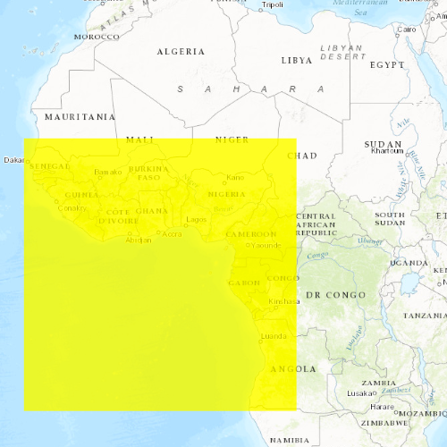

# Identify graphics

Display an alert message when a graphic is clicked.

## Use case

A user may wish to select a graphic on a map to view relevant information about it.

## How to use the sample

Select a graphic to identify it. You will see an alert message displayed.

## How it works

1. Create a `GraphicsOverlay` and add it to the `MapView`.
2. Add a `Graphic` along with a `SimpleFillSymbol` to the graphics overlay.
3. Create a `Point` from the location clicked on the map view by the user from the `mouseClicked` signal on the `MapView`.
4. Identify the graphic on the map view with `identifyGraphicsOverlay(graphicsOverlay, mouse.x, mouse.y, tolerance, returnPopupsOnly, max results)`.

## How it works

When you select a graphic on the map, a message box appears. This is accomplished by first setting up a signal handler for the `mouseClicked` signal on the `MapView`. Once this signal is emitted, call `identifyGraphicsOverlay` on the `MapView`, and pass in the `GraphicsOverlay` to identify on, the mouse coordinates, the tolerance, and the max features. Finally, set up a signal handler on the `MapView` to handle the `identifyGraphicsOverlayStatusChanged` signal. Once the signal emits and the `identifyGraphicsOverlayStatus` is completed, the `identifyGraphicsOverlayResults` will be hydrated with any of the graphics that were identified. If the length of this list of graphics is greater than 0, show the message dialog that indicates a graphic has been identified.

## Relevant API

* Graphic
* GraphicsOverlay
* MapView

## Tags

graphics, identify
