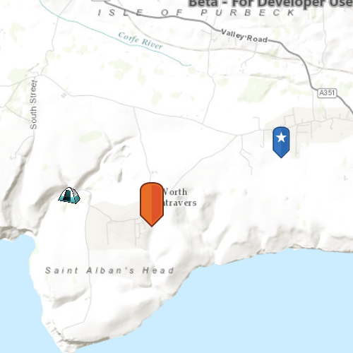

# Picture marker symbol

This sample demonstrates how to create `PictureMarkerSymbol`s from the
different types of image resources.

## How it works

A `GraphicsOverlay` is added to a `MapView`. Three `Graphic`s are added
to the `GraphicsOverlay` with `PictureMarkerSymbol`s which are created
with three different image sources, URL, Qt resource, and file path.

## Offline Data

Read more about how to set up the sample’s offline data
[here](http://links.esri.com/ArcGISRuntimeQtSamples).

| Link                                                                                                 | Local Location                                             |
| ---------------------------------------------------------------------------------------------------- | ---------------------------------------------------------- |
| [orange\_symbol Png File](https://www.arcgis.com/home/item.html?id=1c95ea3b6e4843cdbd6ae354efb97f0c) | `<userhome>`/ArcGIS/Runtime/Data/symbol/orange\_symbol.png |
