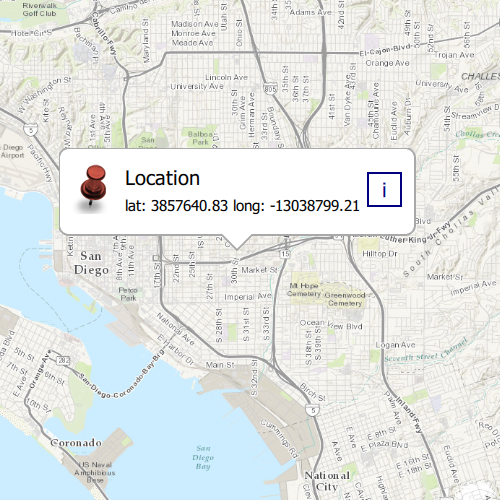

#Show callout

This sample demonstrates how to show location coordinates on a `Map` using a `Callout`.

##How it works
A `Callout` is created, and its `calloutData` property is bound to a `MapView`'s calloutData. Using the `onMouseClicked` signal handler, the calloutData's `detail` is edited to display the mouseclick's coordinates.

##Features
- Map
- MapView
- Callout
- Viewpoint
- SpatialReference
