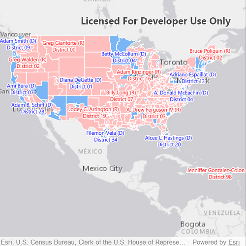

# Show labels on layers

Display custom labels on a feature layer.

## Use case

Labeling features is useful to visually display a key piece of information or attribute of a feature on a map. For example, you may want to label rivers or street with their names.

## How to use the sample

Pan and zoom around the United States. Labels for congressional districts will be shown in red for Republican districts and blue for Democrat districts. Notice how labels pop into view as you zoom in.

## How it works

To show custom labels on a feature layer:

1. A `FeatureLayer` and `ServiceFeatureTable` are created by passing in a URL to the REST endpoint of a map service.
2. A label JSON is created using the ArcGIS [JSON specification for labels](https://developers.arcgis.com/web-map-specification/objects/labelingInfo/).
3. A `LabelDefinition` is created from the label JSON.
4. The `LabelDefinition` is added to the list of `LabelDefinitions` in the `FeatureLayer` instance.
5. Labels are enabled on the `FeatureLayer` by setting `labelsEnabled` to true.

## Relevant API

* FeatureLayer
* LabelDefinition
* TextSymbol

## About the data

This sample uses the [USA 116th Congressional Districts](https://www.arcgis.com/home/item.html?id=cc6a869374434bee9fefad45e291b779) feature layer hosted on ArcGIS Online.

## Additional information

Help regarding the JSON syntax for defining the `LabelDefinition.FromJson` syntax can be found in [labeling info](https://developers.arcgis.com/web-map-specification/objects/labelingInfo/) in the *Web map specification*.

## Tags

attribute, deconfliction, label, labeling, string, symbol, text, visualization