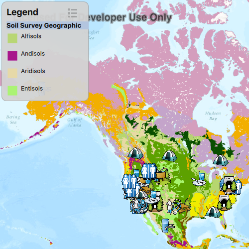

#Show legend

This sample demonstrates how to show a legend for all the operational layers in the map.

##How it works
The sample loops through each layer in the operational layers list and calls `fetchLegendInfos` method on it or its sublayers. On completion, the method returns a list of `LegendInfo` objects. Each of these objects contain the symbol and the name describing the legend. This information is added to a QML list model and displayed in a list view.

##Features
- MapView
- Map
- Basemap
- ArcGISMapImageLayer
- ArcGISSublayerListModel
- ArcGISTiledLayer
- FeatureLayer
- ServiceFeatureTable
- LegendInfo