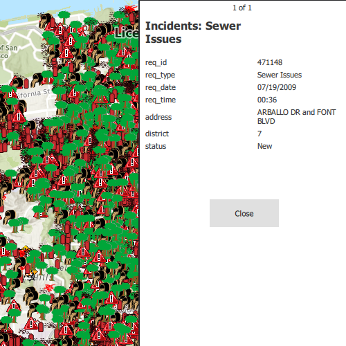

# Show a popup

Show predefined popups from a web map.

## Use case

Many web maps contain predefined popups which are used to display the attributes associated with each feature layer in the map, such as hiking trails, land values, or unemployment rates. You can display text, attachments, images, charts, and web links. Rather than creating new popups to display information, you can easily access and display the predefined popups.

## How to use the sample

Tap on the features to prompt a popup that displays information about the feature.

## How it works

1. Create and load a `Map` using a URL.
2. Set the map to a `MapView` and connect to the `MapView.mouseClicked` signal.
3. Use `GeoView.identifyLayer(layer, x, y, tolerance, allowPopupsOnly)` to identify the top-most feature.
4. Create a `PopupManager` for each of the result's `Popup`s and append them to a list.
5. Assign the list of popup managers to the `PopupStackView.popupManagers` property.
6. Display the popup stack view.

## Relevant API

* IdentifyLayerResult
* Map
* PopupManager
* PopupStackView

## About the data

This sample uses a [feature layer](https://sampleserver6.arcgisonline.com/arcgis/rest/services/SF311/FeatureServer/0) that displays reported incidents in San Francisco.

## Tags

feature, feature layer, popup, web map
