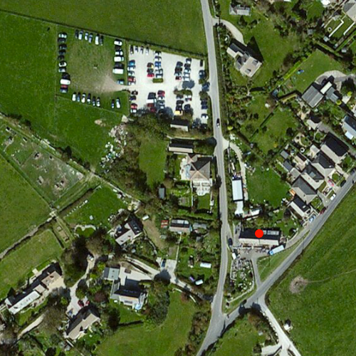

# Simple marker symbol

Show a simple marker symbol on a map.

## Use case

Customize the appearance of a point suitable for the data. For example, a point on the map styled with a circle could represent a drilled borehole location, whereas a cross could represent the location of an old coal mine shaft.

## How to use the sample

The sample loads with a predefined simple marker symbol, set as a red circle.

## How it works

1. Create a `GraphicsOverlay` and add a `Graphic` to it.
2. The `Graphic` sets a `Point` geometry and a red circle `SimpleMarkerSymbol`.

## Relevant API

* Graphic
* GraphicsOverlay
* Point
* SimpleMarkerSymbol

## Tags

SimpleMarkerSymbol, symbol