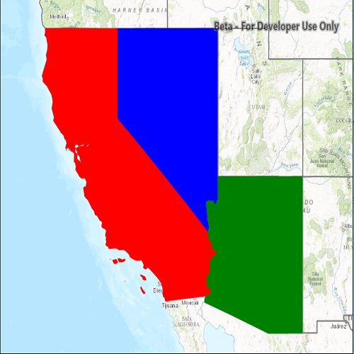

# Unique value renderer

Render features in a layer using a distinct symbol for each unique attribute value.

## Use case

A unique value renderer allows you to symbolize features in a layer based on one or more matching attributes. This is typically done by using unique colors, fill styles, or images to represent features with equal values in a string field. A unique value renderer could be used to show different types of trees on a vegetation map by using a symbols corresponding to matching name attributes.

## How to use the sample

The map with the symbolized feature layer will be shown automatically when the sample loads.

## How it works
This sample demonstrates how to use a `UniqueValueRenderer` to style different features in a `FeatureLayer`. Using the `UniqueValueRenderer` allows for separate symbols to be used for features that have a specific value in a certain field. In this case, the field is state abbreviations in the USA. Multiple fields can be used; this sample only uses one.

1. Multiple `SimpleFillSymbols`s are defined for each type of feature we want to render differently.
2. `SimpleFillSymbol`s can be applied to polygon features, which is the type of feature used for this `ServiceFeatureTable`.
3. Separate `UniqueValue`s objects are created which define the values in the renderer field and what symbol should be used to render matching features.
4. A default symbol is created to render all features that do not match the `UniqueValue`s defined.

## Relevant API

* FeatureLayer
* ServiceFeatureTable
* SimpleFillSymbol
* SimpleLineSymbol
* UniqueValue
* UniqueValueRenderer

## About the data

The map shows U.S. states symbolized by subregion. Symbols are defined for *Pacific*, *Mountain*, and *West South Central* states. All other features are symbolized with the default symbol.

## Tags

draw, renderer, symbol, symbology, values