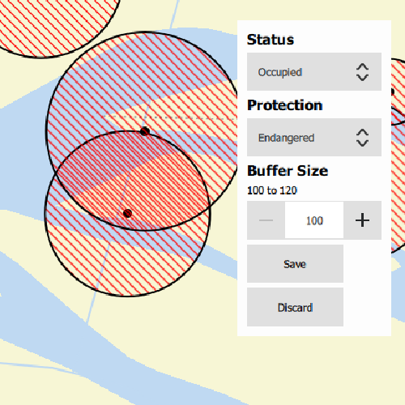

# Add features with contingent values

Create and add features whose attribute values satisfy a predefined set of contingencies.

## Use case

Contingent values are a data design feature that allow you to make values in one field dependent on values in another field. Your choice for a value on one field further constrains the domain values that can be placed on another field. In this way, contingent values enforce data integrity by applying additional constraints to reduce the number of valid field inputs.

For example, a field crew working in a sensitive habitat area may be required to stay a certain distance away from occupied bird nests, but the size of that exclusion area differs depending on the bird's level of protection according to presiding laws. Surveyors can add points of bird nests in the work area and their selection of the size of the exclusion area will be contingent on the values in other attribute fields.

## How to use the sample

Tap on the map to add a feature symbolizing a bird's nest. Then choose values describing the nest's status, protection, and buffer size. Notice how different values are available depending on the values of preceding fields. Once the contingent values are validated, tap "Save" to add the feature to the map.

## How it works

1. Create and load a `Geodatabase`.
2. Load the "BirdNests" `GeodatabaseFeatureTable`.
3. Load the `ContingentValuesDefinition` from the feature table.
4. Create a new `FeatureLayer` from the feature table and add it to the map.
5. Create a new `Feature` from the feature table using `FeatureTable.createFeatureWithAttributes`
6. Supply the initial list of selections. This can also be retrieved from the `FeatureTable`'s `Field`'s `CodedValueDomain`
7. After making the initial selection, retrieve the valid contingent values for each field as you select the values for the attributes.
  i. Create a `ContingentValuesResult` from `FeatureTable.contingentValues` and pass in the current feature and the target field by name.
  ii. Get a list of valid `ContingentValue`s from `ContingentValuesResult.contingentValuesByFieldGroup` with the name of the relevant field group.
  iii. Loop through the list to create a list of `ContingentCodedValue` names or the minimum and maximum values of a `ContingentRangeValue` depending on the type of `ContingentValue` returned.
8. Validate the new feature's contingent values by creating a list of `ContingencyConstrantViolation`s by passing the new feature to `FeatureTable.validateContingencyConstraints`. If the list is empty, then it is valid and can be saved to the map.

## Relevant API

* ContingencyConstraintViolation
* ContingentCodedValue
* ContingentRangeValue
* ContingentValuesDefinition
* ContingentValuesResult
* Geodatabase
* GeodatabaseFeatureTable

## Offline Data

To set up the sample's offline data, see the [Use offline data in the samples](https://github.com/Esri/arcgis-runtime-samples-qt#use-offline-data-in-the-samples) section of the Qt Samples repository overview.

Link | Local Location
---------|-------|
|[Contingent Values Bird Nests](https://www.arcgis.com/home/item.html?id=e12b54ea799f4606a2712157cf9f6e41)| `<userhome>`/ArcGIS/Runtime/Data/geodatabase/ContingentValuesBirdNests.geodatabase |
|[Fillmore topographic map](https://arcgis.com/home/item.html?id=b5106355f1634b8996e634c04b6a930a) | `<userhome>`/ArcGIS/Runtime/Data/vtpk/FillmoreTopographicMap.vtpk |

## About the data

The mobile geodatabase contains birds nests in the Fillmore area, defined with contingent values. Each feature contains information about its status, protection, and buffer size.

## Additional information

Learn more about contingent values and how to utilize them on the [ArcGIS Pro documentation](https://pro.arcgis.com/en/pro-app/latest/help/data/geodatabases/overview/contingent-values.htm).

## Tags

coded values, contingent values, feature table, geodatabase, range values
