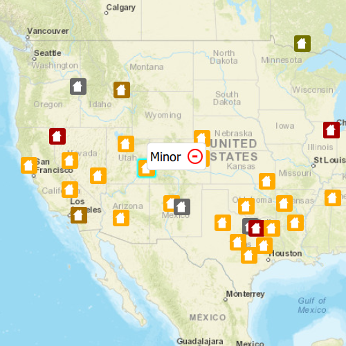

# Delete features (feature service)

Delete features from an online feature service.

## Use case

Sometimes users may want to delete features from an online feature service.

## How to use the sample

* click on a feature on the Map
* click on the delete button

## How it works

1. Create a `ServiceFeatureTable` object from a URL.
2. Create a `FeatureLayer` from the service feature table.
3. Select features from the feature layer via `selectFeatures()`.
4. Remove the selected features from the table using `deleteFeatures()`.
5. Update the table on the server using `applyEdits()`.

## Relevant API

* Feature
* FeatureLayer
* ServiceFeatureTable

## Tags

deletion, feature, online, Service, table