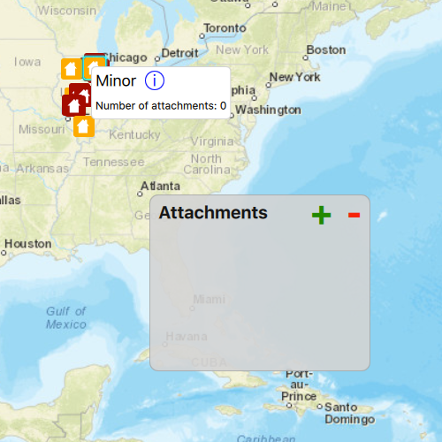

# Edit feature attachments

The sample demonstrates how to add, delete, and fetch attachments for a specific feature in a feature service.

## How it works

Click or tap on a feature to show its callout. The callout specifies the number of attachments for that particular feature. Selecting on the `info` button inside the callout shows the list of those attachments. In the list you can add a new attachment by selecting the `+` button. You can delete an attachment by selecting an attachment and selecting the `-` button. This is all controlled through the attachment list model, which is obtained through the feature. The attachment list model works similarly to other QML models, and can be directly fed into a list view for easy display and user interaction. 

By default, `fetchAttachmentInfos` is called automatically for the selected feature, which will request the attachment info JSON from the service. This JSON contains information such as name (the file name) and attachmentUrl (the URL to the file data.) 

To edit the attachments, call `addAttachment` or `deleteAttachment` on the `AttachmentListModel`. By default, edits are automatically applied to the service and applyEdits does not need to be called. 

## Features
- MapView
- Map
- Basemap
- Viewpoint
- SpatialReference
- ServiceFeatureTable
- FeatureLayer
- Feature
- ArcGISFeature
- FeatureEditResult
- FeatureQueryResult
- AttachmentListModel
