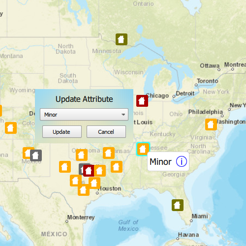

# Update attributes (feature service)

Update feature attributes in an online feature service.

## Use case

Online feature services can be updated with new data. This is useful for updating existing data in real time while working in the field.

## How to use the sample

To change the feature's damage property, tap the feature to select it, and update the damage type using the drop down.

## How it works

Features in the map represent damage inspection points and are symbolized based on an attribute specifying the type of damage. Selecting an inspection point displays a callout. The callout contains information about the type of damage. To change the type of damage, select the `information` button in the callout. An editing window appears, allowing you to choose new attribute values. Selecting the `update` button will update the inspection point with the new value. 

This is done by first obtaining the inspection point feature after it is selected. Once the feature is obtained, the feature's attribute is updated by calling `setAttributeValue`. To update the feature in the feature table, call `updateFeature` and pass in the edited feature. Finally, to update the service, call `applyEdits` to apply the edits to the service.

## How it works

1. Create a `ServiceFeatureTable` object from a URL.
    * When the table loads, you can get the domain to determine which options to present in your UI.
2. Create a `FeatureLayer` object from the `ServiceFeatureTable`.
3. Select features from the `FeatureLayer`.
4. To update the feature's attribute, first load it, then use the `attributeValue`.
5. Update the table with `updateFeature`.
6. After a change, apply the changes on the server using `applyEdits`.

## Relevant API

* ArcGISFeature
* FeatureLayer
* ServiceFeatureTable

## Tags

amend, attribute, details, edit, editing, information, value