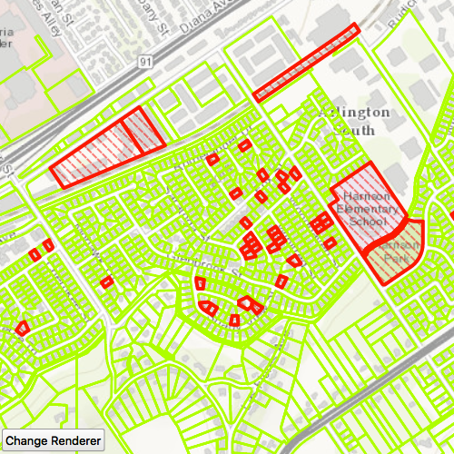

# Feature layer change renderer

Change the appearance of a feature layer with a renderer.

## Use case

A feature layer hosted on ArcGIS Online has a preset renderer and will display in an ArcGIS Runtime application with that renderer. However, for example, the color associated with the original renderer may be unsuitable for a company with staff or clients who are color blind, or for presentation with a different set of basemap and operational layers. In these cases, the renderer on the feature layer's data can be set to a more suitable color.

## How to use the sample

Use the button in the control panel to change the renderer on the feature layer. The original renderer displays red polygons around parcels that do not have a pool permit. When the blue renderer in this sample is applied, all parcels are indicated by blue polygons.

## How it works

A `SimpleRenderer` is created with a `SimpleLineSymbol`. When the button is clicked, the `renderer` property on the `FeatureLayer` is set to the new `SimpleRenderer`.

## How it works

1. Create a `ServiceFeatureTable` from a URL.
2. Create a `FeatureLayer` from the service feature table.
3. Create a new renderer (in this case, a `SimpleRenderer`).
4. Change the feature layer's renderer using `featureLayer.renderer`.

## Relevant API

* FeatureLayer.renderer
* ServiceFeatureTable
* SimpleRenderer

## About the data

This sample displays a feature layer showing areas that do or do not have pool permits. 

## Tags

feature layer, renderer, visualization
