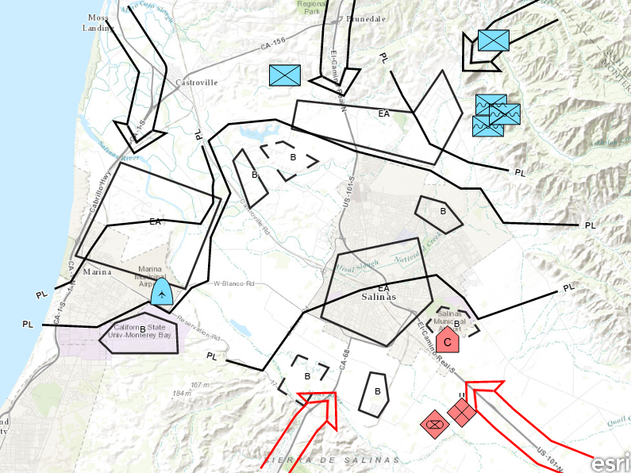

# Feature layer (dictionary renderer)

Convert features into graphics to show them with mil2525d symbols.

## Use case

A dictionary renderer uses a style file along with a rule engine to display advanced symbology. 
This is useful for displaying features using precise military symbology.

## How to use the sample

Pan and zoom around the map. Observe the displayed military symbology on the map.

## How it works

This sample loads a number of point, line, and polygon feature tables from a Runtime geodatabase. For each feature table, a `FeatureLayer` is created, and a `DictionaryRenderer` object is created and applied to the layer. Note that each layer needs its own renderer, though all renderers can share the DictionarySymbolStyle, in which case all layers will use the same symbology specification (MIL-STD-2525D in the case of this sample). Each layer is added to the map, and when all layers are loaded, the map's viewpoint is set to zoom to the full extent of all feature layers.

## How it works

1. Create a `Geodatabase` with a given path.
2. Wait for geodatabase to completely load by connecting to the `loadStatusChanged` signal and checking the `loadStatus`.
3. Cycle through each `GeodatabaseFeatureTable` from the geodatabase using `Geodatabase.geodatabaseFeatureTables()`.
4. Create a `FeatureLayer` from each table within the geodatabase.
5. Wait for each layer to load by connecting to the layer's `loadStatusChanged` signal and checking the `loadStatus`.
6. After the last layer has loaded, then create a new `Envelope` from a union of the extents of all layers.
   * Set the envelope to be the `Viewpoint` of the map view using `MapView.setViewpoint(new Viewpoint(Envelope))`.
7. Add the feature layer to map using `Map.operationalLayers.append(FeatureLayer)`.
8. Create `DictionaryRenderer` and attach to the feature layer by setting `FeatureLayer.renderer`.

## Relevant API

* DictionaryRenderer
* DictionarySymbolStyle
* Geodatabase

## Offline Data
Read more about how to set up the sample's offline data [here](http://links.esri.com/ArcGISRuntimeQtSamples).

Link | Local Location
---------|-------|
|[Mil2525d Stylx File](https://www.arcgis.com/home/item.html?id=c78b149a1d52414682c86a5feeb13d30)| `<userhome>`/ArcGIS/Runtime/Data/styles/arcade_style/mil2525d.stylx |
|[Military Overlay geodatabase](https://www.arcgis.com/home/item.html?id=e0d41b4b409a49a5a7ba11939d8535dc)| `<userhome>`/ArcGIS/Runtime/Data/geodatabase/militaryoverlay.geodatabase |

## Tags

DictionaryRenderer, DictionarySymbolStyle, military, symbol
