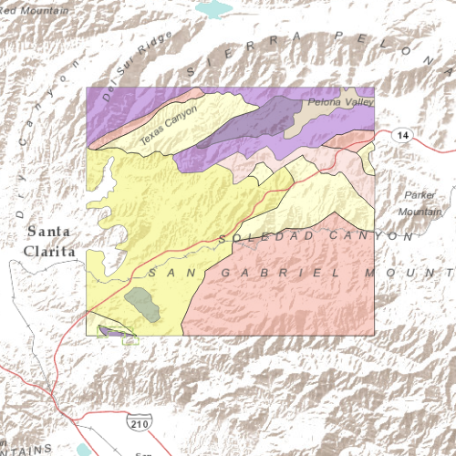

#Feature layer (feature service)

This sample demonstrates how to add a feature layer using a feature service to the map. 

##How it works

The sample declares a FeatureLayer using a ServiceFeatureTable with a URL REST endpoint to the feature service. The FeatureLayer is then added to the Map.

##Features
- MapView
- Map
- Basemap
- ServiceFeatureTable
- FeatureLayer
