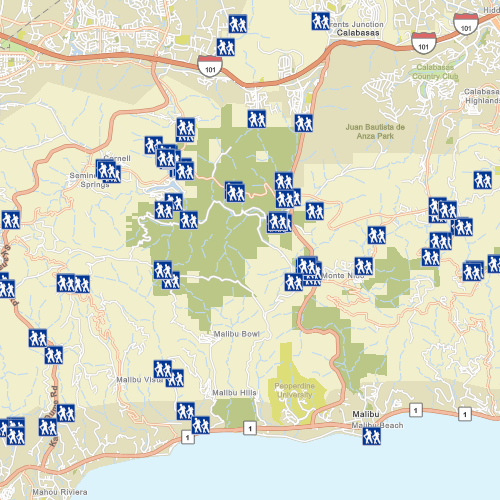

# Feature layer (geodatabase)

Display features from a local geodatabase.

## Use case

Accessing data from a local geodatabase is useful when working in an environment that has an inconsistent internet connection or that does not have an internet connection at all. For example, a department of transportation field worker might source map data from a local geodatabase when conducting signage inspections in rural areas with poor network coverage. 

## How to use the sample

Pan and zoom around the map. View the data loaded from the geodatabase.

## How it works

The sample creates an instance of GeodatabaseFeatureTable by supplying the path to the local mobile geodatabase. The FeatureLayer is then supplied with the GeodatabaseFeatureTable and added to the Map. The mobile geodatabase can either be obtained through ArcMap, with the Create Runtime Content geoprocessing tool, or through a feature service with the GeodatabaseSyncTask.
1. Create a geodatabase using the provided local resource.
2. Get the 'Trailheads' `GeodatabaseFeatureTable` from the geodatabase, `Geodatabase.geodatabaseFeatureTable(tableName)`.
4. Create a feature layer using the table from above.
5. Add the feature layer to the `Map`.

## Relevant API

* FeatureLayer
* Geodatabase
* GeodatabaseFeatureTable

## Offline data

Read more about how to set up the sample's offline data [here](http://links.esri.com/ArcGISRuntimeQtSamples).

Link | Local Location
---------|-------|
|[Los Angeles Vector Tile Package](https://www.arcgis.com/home/item.html?id=d9f8ce6f6ac84b90a665a861d71a5d0a)| `<userhome>`/ArcGIS/Runtime/Data/vtpk/LosAngeles.vtpk |
|[Los Angeles Trailheads](https://www.arcgis.com/home/item.html?id=2b0f9e17105847809dfeb04e3cad69e0)| `<userhome>`/ArcGIS/Runtime/Data/geodatabase/LA_Trails.geodatabase |

## About the data

The sample shows trailheads in the greater Los Angeles area displayed on top of a vector tile basemap.

## Additional information

One of the ArcGIS Runtime data set types that can be accessed via the local storage of the device (i.e. hard drive, flash drive, micro SD card, USB stick, etc.) is a mobile geodatabase. A mobile geodatabase can be provisioned for use in an ArcGIS Runtime application by ArcMap. The following provide some helpful tips on how to create a mobile geodatabase file:

In ArcMap, choose File > Share As > ArcGIS Runtime Content from the menu items to create the .geodatabase file (see the document: http://desktop.arcgis.com/en/arcmap/latest/map/working-with-arcmap/creating-arcgis-runtime-content.htm). 

Note: You could also use the 'Services Pattern' and access the Geodatabase class via a Feature Service served up via ArcGIS Online or ArcGIS Enterprise. Instead of using the Geodatabase class to access the .geodatabase file on disk, you would use GeodatabaseSyncTask point to a url instead.

## Tags

geodatabase, mobile, offline