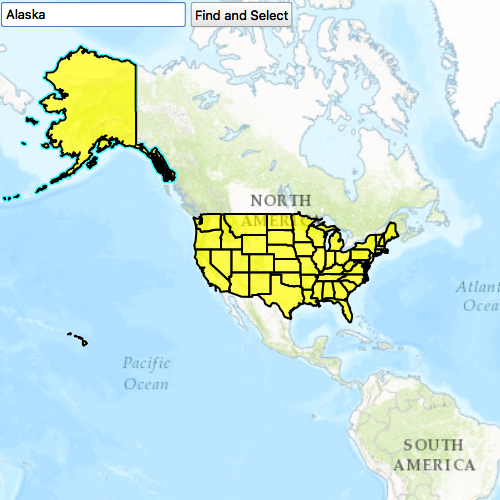

#Feature layer query

This sample demonstrates how to query a feature layer using a feature table.

##How it works

Enter part of a USA state name in the text box and select the Find and Select button. The sample uses the text from the text box to query for the state name, and will select the features returned from the query. Also, the map view will pan and zoom to the first feature in the list of selected features.

##Features
- MapView
- Map
- Basemap
- Viewpoint
- SpatialReference
- ServiceFeatureTable
- FeatureLayer
- Viewpoint
