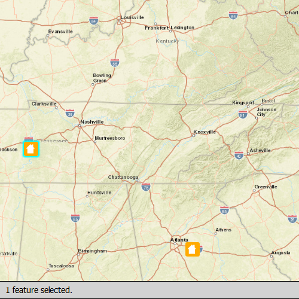

#Feature layer selection

This sample demonstrates how to select features in a feature layer. Tap on an area of the map where you see features to select features.

##How it works

Tap on an area of the map where you see features to select features. This will execute an `identifyLayer` operation on the map view. The `identifyLayerComplete` signal will fire, and a list of features will be returned. Call the `selectFeatures` method on the feature layer, and pass in the list of features, and this will select the features and highlight them on the map view.

##Features
- MapView
- Map
- Basemap
- Viewpoint
- SpatialReference
- ServiceFeatureTable
- FeatureLayer
- Feature
- Envelope
- GeoElement
