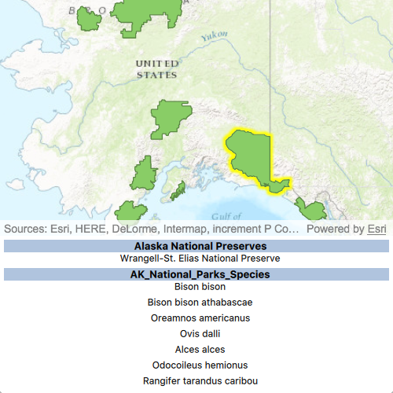

# List related features

List features related to the selected feature.

## Use case

Related features are useful for managing relational information, like what you would store in a relational database management system (RDBMS). You can define relationship between records as one-to-one, one-to-many, or many-to-one. For example, you could model inspections and facilities as a many-to-one relationship. Then, for any facility feature, you could list related inspection features.

## How to use the sample

Click on a feature to select it. The related features will be displayed in a list.

## How it works
A `Map` is constructed by passing a URL to a web map stored in ArcGIS Online. A connection is made to the `mouseClicked` signal of the `MapView`, and when this signal emits, `selectFeatures` is executed on the `FeatureLayer`. Once this completes, a `FeatureQueryResult` is returned, giving access to the `FeatureIterator`. This `FeatureIterator` contains all of the `Feature` objects selected with the mouse click. These `Feature` objects are iterated over, and for each object, the `queryRelatedFeatures` method is called. Once this completes, the returned `RelatedFeatureQueryResult` gives access to all of the related features, and the UI is populated with this information.

1. With a `Feature`, call `queryRelatedFeatures` on the feature's feature table.
2. Iterate over the result's collection of `queryRelatedFeaturesResults` objects to get the related features and add them to a list.

## Relevant API

* Feature
* FeatureTable
* FeatureQueryResult
* FeatureTable.QueryRelatedFeatures
* RelatedFeatureQueryResult

## Tags

features, identify, query, related, relationship, search
